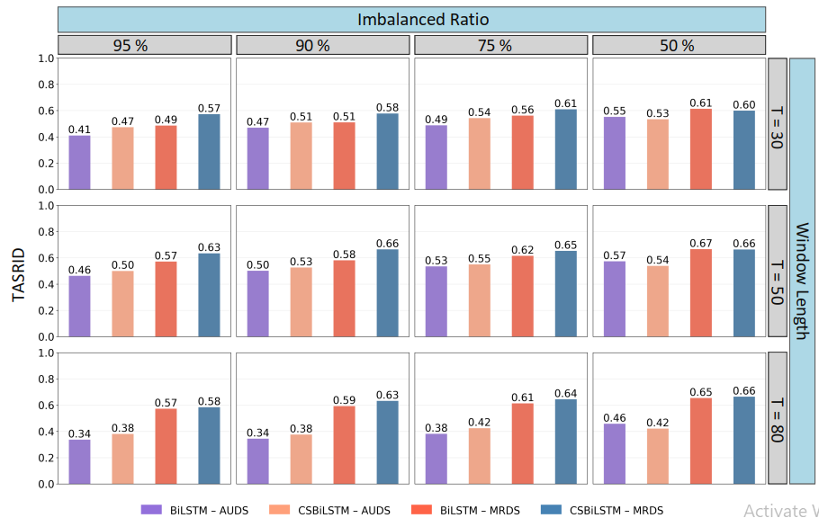

# Imbalance-Aware-LSTM-CCP-Early-Detection
Discover our Imbalance-Aware LSTM Model tailored for Control Chart Pattern Recognition (CCPR). Explore its unique features, including cost-sensitive optimization and adaptive weighting, designed to enhance performance.

## Introduction
This project blends rigorous research with practical application, aiming to set new standards in control chart pattern recognition (CCPR) and fault detection.

<p align="center">
  
</p>


## Key Highlights

- **Research-Driven**: Our model tackles critical challenges such as class imbalance and the limitations of simulated data, enhancing detection in real-time production environments.
- **Evidence-Based**: Extensively validated using both simulated datasets and real-world data from biomanufacturing and wafer industries, demonstrating superior performance and stability.

<p align="center">
  
</p>


## Quick Start Guide
Follow these steps to set up the project and run it on your local machine.

### Prerequisites

**Python 3.9**: Ensure Python 3.9 is installed on your system
**Install Dependencies**: Install all required dependencies listed in the `requirements.txt` file with one simple command:
   ```bash
   pip install -r requirements.txt
   ```

### Installation
**Clone the Repository**: Clone this repository to your local machine using the following command:
   ```bash
   git clone https://github.com/Deraxsi/Imbalance-Aware-LSTM-CCP-Early-Detection.git
   ```


## Citing Our Work

If you find our model useful or our research contributes to your work, we kindly encourage you to cite our publication. This support not only recognizes our effort but also helps enhance the impact of our research. The paper can be accessed [here](https://www.sciencedirect.com/science/article/abs/pii/S0957417424005487)

   ```plaintext
   @article{derakhshi2024imbalance,
     title={An imbalance-aware BiLSTM for control chart patterns early detection},
     author={Derakhshi, Mohammad and Razzaghi, Talayeh},
     journal={Expert Systems with Applications},
     volume={249},
     pages={123682},
     year={2024},
     publisher={Elsevier}
   }
